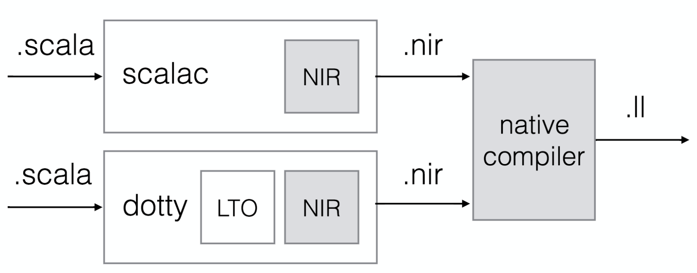

# Contents

- [Scala native](#scala-native)
    - [What is it ?](#what-is-it-)
    - [How does it work ?](#how-does-it-work-)
        - [Compilation Process](#compilation-process)
            - [Compilation Differences with the JVM](#compilation-differences-with-the-jvm)
            - [Sharing libraries](#sharing-libraries)
        - [Runtime](#Runtime)
            - [Memory allocation Differences with the JVM](#memory-allocation-differences-with-the-jvm)
            - [Memory allocation Scala Native alternatives](#memory-allocation-scala-native-alternatives)
    - [Why would you use it ?](#why-would-you-use-scala-native-)
		- [Scala native vs Other System programming languages](#scala-native-vs-other-system-programming-languages)
	- [Examples](#examples)
        - [Fast Startup](#fast-startup)
        - [C Interoperability](#c-Interoperability)

- [Compare](#compare)
    - Kotlin
    - Rust
    - Golang
	- Haskell

# Scala native

## What is it ?

Simple definition:

> Scala compiler to native code.

More complex definition:

> Scala Native is an optimizing ahead-of-time compiler and lightweight managed
> runtime designed specifically for Scala.

- Ahead of time compiler.  Standard Scala: compiles to JVM bytecode. Then the
JVM interpretes the code and executes it as native code. In some cases Java
uses JIT compilation.  Scala native: the compiler compiles directly to native
code. Doesn't rely on the JVM to run its code. (That's why it requires a
Runtime)

- (Lighweight) Runtime ~= VM (Heap management, Garbage Collector, Class loading) 

## How does it work ?

## Compilation process

Scala native is made of a compiler plugin that takes a Scala AST generated by 
*scalac* and generates a representation of that AST in an intermmediate language 
called [nir](https://github.com/scala-native/scala-native/blob/master/docs/contrib/compiler.rst).
Nir code is then compiled into [LLVM assembly language](http://llvm.org/docs/LangRef.html) that is 
then processed by LLVM's native compiler to generate native code in the proper architecture 
(e.g i386, ARM, ...).

**Note:**
**Note:** A high level overview can be found at 
[scala-native:/docs/contrib/compiler.rst](https://github.com/scala-native/scala-native/blob/master/docs/contrib/compiler.rst).

### Compilation differences with the JVM

The initial description of Scala native says that is an

> Optimizing ahead-of-time compiler

What this means is that the code is optimized and compiled directly to "machine code". 

This represents a significant difference with the way that code runs inside the JVM. The code in
the JVM (Bytecode) is initially interpreted. This process is slower than running machine code
directly and this is what explains the JVMs slow startup time. 

However that doesn't mean that code is intrinsically slower than native code because
the JVM has a JIT (Just In Time) compiler that identifies portions of code that run frequently,
optimizes them and then converts them to machine code instructions what makes the JVM not
slow for short running processes (because of this warmup time) but quite competitive in overall
performance once the JIT compilation kicks in.

### Sharing libraries

Regular scala libraries built for the JVM cannot be used in a scala native 
project. To be able to use a scala library inside a scala native project
it needs to be published with its NIR representation.

Publishin a scala native project with its NIR files is as simple as publishing
a normal project, it requires the project to be defined as a scala native project
with `enablePlugins(scalaNativePlugin)` and then to run *publish*.

[sbt-crossproject](https://github.com/portable-scala/sbt-crossproject) is a plugin that
provides cross compilation support for scala projects (for the JVM, Js and Native).

See a list of scala libraries built for native at:

  - [Scaladex - Native](https://index.scala-lang.org/search?q=*&targetTypes=Native)
  - [awesome-scala-native](https://github.com/tindzk/awesome-scala-native)

## Runtime

Since Scala native doesn't run on top of the JVM it cannot rely on the JVM
for Garbage collection and some of the classes that are a part of the Java
Standard Library are therefore not available directly inside Scala Native.

To overcome the limitation of the missing classes of Java's Standard library,
Scala native provides it's own implementation of a 
[subset](http://www.scala-native.org/en/v0.3.9-docs/lib/javalib.html) of the 
JDK core libraries.

### Memory allocation Differences with the JVM

In terms of memory the JVM makes by default the decission of abstracting the
developer from having to think about memory allocation and even forbids
the programming into those details to provide safety, leaving allocating
and free memory to the runtime. More concretely the garbage collector is a
process that run inside the JVM and takes care of freeing unused references.

This paradigm that works well in many cases has its limitations, for example:

1. Memory heavy processes can have long stops when the garbage collector kicks in
2. Programmers of really performant frameworks that need more flexibility 
regarding memory allocation sometimes need to step out of the garbage collector
using *unsafe* or other types of  tricks to be able to provide high performance. 

Scala Native follows a different approach stepping out of the "golden cage" provided
by the JVM to allow manual memory allocation. This approach leaves the door open for
high performance code but comes with the disadvantage that the programmer needs to be
careful about how he uses memory.

### Memory allocation Scala Native alternatives

Even though Scala native provides freedom regarding memory allocation it also allows
the possibility to rely on garbage collectors to free the developer from the burden of
thinking about memory if desired.

Regarding Garbage collection Scala Native let you choose between the inmix and the 
boehm garbage collectors and not using any garbage collector. Here's the description
of everyone of the options that can be found inside [scala native's
documentation](https://scala-native.readthedocs.io/en/v0.3.9-docs/user/sbt.html?highlight=garbage%20collector#garbage-collectors).

> Garbage collectors:
> - immix. (default since 0.3.8, introduced in 0.3)
> Immix is a mostly-precise mark-region tracing garbage collector. More information about the collector is available as part of the original 0.3.0 announcement.
> - boehm. (default through 0.3.7)
> Conservative generational garbage collector. More information is available at the project’s page.
> - none. (experimental, introduced in 0.2)
> Garbage collector that allocates things without ever freeing them. Useful for short-running command-line applications or applications where garbage collections pauses are not acceptable.
>

## Why would you use scala native ?

Scala native comes with the advantages of system programming languages:

- Faster startup
- Use of C libraries
- High performance: Lighter runtime / Low level memory allocation
- Develop Kernel drivers or embedded systems

### Scala native vs Other System programming languages:

- Functional programming
- Reuse of scala libraries (need to be published for native)
    - [Scaladex - Native](https://index.scala-lang.org/search?q=*&targetTypes=Native)
    - [awesome-scala-native](https://github.com/tindzk/awesome-scala-native)
- Use of Scala tooling (sbt, intellij)

Disadvantages:

- Number of contributors (mostly a one-man project)
- Lack of documentation
- Can't use Java libraries.
- Can't use Scala libraries unless published with nir headers.
- Using C libraries
    - Need of shared libraries
    - Loss of type safety
    - More complex build
	- Careful with memory management

## Examples 

### Fast Startup

See [hello-world](hello-world) example.

### C Interoperability 

See [c-lib-interop](c-lib-interop) example.

# Compare

## kotlin

## vs rust

Differences

- Opinionate approach to memory management (statically verified) vs garbage collector.
- Wider ecosystem (wider libraries and adoption on rust)

Similarities

- Favour functional programming
- Powerful type system (see differences)

## vs golang

Differences

- Super simple type system and language design overall (no generics, weird error handling)

